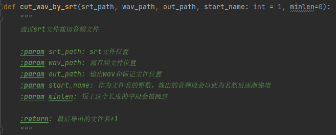
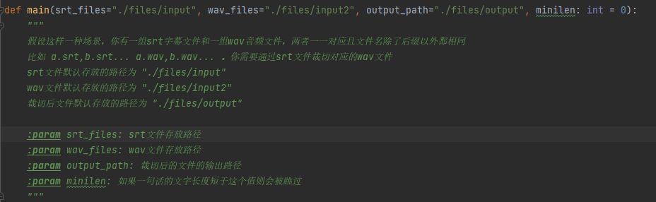

# Sound_Dataset_Tools

## 介绍
通过音频文件和SRT字幕文件制作语音数据集
包含了一些常用脚本，和使用例

以及一些经验，不保证对

## 软件架构
如你所见 python，以及sqlite


## 安装教程

安装requirements

```
pip install -r requirements.txt -i https://pypi.tuna.tsinghua.edu.cn/simple/
```

同时你还需要ffmpeg，安装请参考 [ffmpeg](https://ffmpeg.org/download.html#get-packages)

## 使用说明

用户最好还是有点python基础

本项目主要用于从一个网络上下载的视频开始，制作语音数据集，接下来会介绍整个流程，软件使用方式会穿插其中，你也可以直接看 `utils/tools` 中的函数文档，已经用中文写得很详细了






## 数据集制作流程

### 0.可能用到的其他软件工具

- 格式工厂等音频处理软件，当然也许你能熟练使用ffmpeg，那就不用了

- UVR：清除人声以外的BGM

  UVR项目地址：https://github.com/Anjok07/ultimatevocalremovergui

  UVR介绍（我觉得是不用自己装CUDA）：http://www.staycu.com/1731.html

- 剪映，用于语音转字幕

### 1.获取视频素材

录播、切片等

**注意点：**

- 尽量选择单发音人素材
- BGM越少越好，BGM声音越小越好
- 尽量平直叙述
- 声线尽量一致，尽量避免假声、音频特效

### 2.提取音频

我使用的是格式工厂的音频-分离器功能

### 3.UVR分离音频取得人声

个人觉得比较适用的模型：

- `MDX-Net` 下的 `UVR-MDX-MAIN` 并开启 Demucs Model

- `VR Architecture` 下的 `4_HP-Vocal-UVR.pth` 并将Aggression Setting 设置为20

具体用哪个可以都试一下 选择效果最好的 我选择是是 `UVR-MDX-MAIN` 

如果你有N卡速度会很快，但是AMD用户（比如我）就只能用CPU慢慢来了

### 4.粗剪辑音频

大致过一下语音然后剪掉效果不好/没有语音的部分，避免生成字幕导致污染数据集

个人建议不要改变音频的原长度，也就是被剪辑掉的部分填充静音帧进去，或者直接只取全程都可用的素材

### 5.语音转字幕

使用剪映的语音转字幕功能生成字幕，然后再将字幕单独导出

### 6.通过字幕裁剪音频

**说明：**

假设这样一种场景，你有一组srt字幕文件和一组wav音频文件，两者一一对应且文件名除了后缀以外都相同比如 a.srt,b.srt... a.wav,b.wav... 你需要通过srt文件裁切对应的wav文件

输出文件命名将从1开始逐渐递增，同时会输出一个labels.txt文件标注每个音频的对应文字，格式为：音频名+|+文字，例：【1|卡尔普陪外孙玩滑梯】

**特殊处理：**

1. 剪映生成的字幕经常出现在很短的空隙中截断，导致两句之间没有间隔或间隔很小，程序将自动将间隔在35ms以内的字段合为一个，详见 `tools.py` 中的 `get_hebing` 函数
2. 剪映生成的字幕开始位置经常过于靠后，程序会自动监测当前开始位置是否为静音帧,如果不是则会向前寻找静音帧以修正字幕开始位置，详见 `tools.py` 中的 `check_start_ok` 函数
3. 剪映生成的字幕结束位置经常过于靠后，程序会自动监测当前结束位置是否为静音帧,如果是则会向前寻找非静音帧以修正字幕结束位置，详见 `tools.py` 中的 `cut_long_end` 函数

**参数说明：**

| 参数名      | 介绍                                     | 默认值           |
| ----------- | ---------------------------------------- | ---------------- |
| srt_files   | srt文件存放路径                          | "./files/input"  |
| wav_files   | wav文件存放路径                          | "./files/input2" |
| output_path | 裁切后的文件的输出路径                   | "./files/output" |
| minilen     | 如果一句话的文字长度短于这个值则会被跳过 | 0                |


请注意路径，建议使用绝对路径避免问题

```python
from examples import cut_wav_by_srt

cut_wav_by_srt.main(minilen=6)
# 完整参数示例：
# cut_wav_by_srt.main(srt_files="./files/input", wav_files="./files/input2", output_path="./files/output", minilen=6)
```

如果你在项目根路径下 你也可以这样通过命令行执行（默认minlen为6 可以在 `cut_wav_by_srt.py` 最下面修改）

```shell
python examples/cut_wav_by_srt.py
```

### 7.将数据录入数据库

平常的数据集制作到这里就结束了，但是我们的标准比这更高

todo 我写累了 大家先看tools.py吧 里面的函数文档是全的


